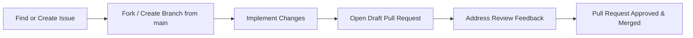
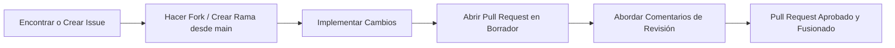

# 📘 GeoResponde Contributor Onboarding Guide

Welcome to the GeoResponde community! This guide will walk you through your first steps as a contributor, from understanding our vision to making your first successful pull request.

---

## 1. Our Vision: Why Federation Matters

GeoResponde exists to solve a critical problem: during disasters, information becomes fragmented across humanitarian platforms, scientific agencies, and government portals.

**Our core principle is federation over duplication.** Instead of creating yet another isolated database, we connect existing trusted systems. This approach:
- **Respects data ownership** – organizations remain the authoritative source of their information.
- **Amplifies existing efforts** – we enhance, not replace, the work of humanitarian and scientific institutions.
- **Ensures sustainability** – by not hosting data ourselves, we avoid the maintenance burden and obsolescence of a central database.

This federated architecture is why our "Provider Gateway" is the heart of the system. Understanding this vision is key to contributing effectively.

---

## 2. Repository Structure (Monorepo)

GeoResponde is organized as a **pnpm workspace monorepo** to keep code modular and maintainable. Here's what each directory contains:

| Directory | Purpose |
| :--- | :--- |
| `frontend/` | React + TypeScript application with MapLibre for the user interface. |
| `backend/` | Fastify API server. Contains the **Provider Gateway** logic that federates data from external sources. |
| `packages/` | Shared code between frontend and backend (TypeScript types, utilities, the **Provider SDK** for building integrations). |
| `data/` | Static or test data files (e.g., sample GeoJSON for development). |
| `docs/` | Project documentation. New guides like this one live here (`docs/community/`). |
| `knowledge/` | Curated scientific knowledge layers (e.g., fault lines, hazard zones). |

---

## 3. Prerequisites

Before you start, ensure you have the following installed:

- **[Git](https://git-scm.com/)**
- **[Node.js](https://nodejs.org/) (v18 or higher)**
- **[pnpm](https://pnpm.io/) (v8 or higher)** – install globally with `npm install -g pnpm`
- A code editor (we recommend **VS Code** with TypeScript and ESLint extensions)

---

## 4. Development Setup

1.  **Clone the repository:**
    ```bash
    git clone https://github.com/GeoResponde/GeoResponde.git
    cd GeoResponde
    ```

2.  **Install dependencies:**
    ```bash
    pnpm install
    ```

3.  **Set up environment variables:**
    - Copy the example file: `cp backend/.env.example backend/.env`
    - Default values usually work for local development.

4.  **Start the development servers:**
    ```bash
    pnpm dev
    ```
    This concurrently launches:
    - **Frontend:** `http://localhost:5173`
    - **Backend:** `http://localhost:3001`

5.  **Verify:** Open both URLs in your browser. You should see the GeoResponde interface and get a response from the backend API.

---

## 5. Finding Your First Task

We use **GitHub labels** to help you find suitable issues:

- `good first issue` – **Perfect for beginners.** These tasks are well-scoped and documented. **Start here!**
- `help wanted` – Issues where the team specifically needs external help.
- `provider-integration` – Tasks related to adding or improving data providers.
- `scientific-layers` – Work on integrating scientific intelligence (satellite data, hazard layers).
- `bug` – Bug reports.
- `enhancement` – Feature requests.

To find your first issue, go to the [Issues page](https://github.com/GeoResponde/GeoResponde/issues) and filter by these labels.

---

## 6. Recommended Contribution Workflow

We follow a standard GitHub flow to keep contributions organized:



**Detailed steps:**

1.  **Find an Issue:** Comment on the issue you want to work on to let maintainers know.
2.  **Create a Branch:** From the `main` branch, create a descriptive branch:
    - `feature/your-feature-name` (for new functionality)
    - `fix/issue-description` (for bug fixes)
    - `docs/your-documentation` (for documentation updates)
3.  **Work on Changes:** Commit your work with clear, atomic commits.
4.  **Open a Draft PR:** As soon as you have some work to show, open a **Draft Pull Request**. This tells maintainers you're working on it and allows for early feedback. **Include a `Closes #ISSUE_NUMBER` in the PR description** to link it to the issue.
5.  **Iterate:** Address feedback from reviewers. Keep your branch updated with `main` (using `rebase` is preferred).
6.  **Ready for Review:** When you're confident, mark your PR as "Ready for review". A maintainer will do a final check and merge it.

---

## 7. Coding Standards

- **Language:** All new code must be written in **TypeScript**.
- **Style:** We use **ESLint** and **Prettier**. Run these before committing:
    ```bash
    pnpm lint
    pnpm format
    ```
- **Naming Conventions:**
    - Files/folders: `kebab-case` (e.g., `provider-gateway.ts`)
    - React components: `PascalCase` (e.g., `SituationMap.tsx`)
    - Variables/functions: `camelCase` (e.g., `fetchHumanitarianData`)
- **Documentation:** Add JSDoc comments to new functions and complex logic.

---

## 8. Best Practices: Working with Providers & Scientific Layers

This is a crucial part of contributing. Follow these guidelines:

- **Respect the Federated Model:**
    - **Do NOT cache data indefinitely.** Act as a proxy. Request fresh data from the provider's API when a user asks for it.
    - **Respect rate limits** and terms of service of the external provider.
    - **Handle errors gracefully.** If a provider is down, show a clear message to the user, don't break the whole application.

- **Building a New Provider:**
    - Use the `Provider SDK` from the `packages/` folder.
    - Implement the required interfaces for fetching and searching data.
    - Write tests to ensure your integration works reliably.
    - Add your provider to the configuration so it appears in the frontend.

- **Integrating Scientific Layers:**
    - Ensure data is in a standard geospatial format (e.g., **GeoJSON**).
    - For large datasets, consider using vector tiles or caching on the backend with a sensible TTL (Time-To-Live).
    - Focus on clear visualization – the goal is to make scientific intelligence accessible to humanitarian responders.

---

## 9. Pull Request (PR) Workflow Checklist

Before submitting your PR for final review, ensure:

- [ ] Code passes all `pnpm lint` and `pnpm format` checks.
- [ ] Functionality has been tested locally.
- [ ] Documentation has been updated (if applicable).
- [ ] PR title and description are clear, with `Closes #ISSUE_NUMBER`.
- [ ] You have followed the provider/scientific layer best practices (if relevant).

---

## 10. Communication Channels

- **For technical discussions on specific tasks:** Comment directly on the **Issue or PR**.
- **For general questions or ideas:** Use **[GitHub Discussions](https://github.com/GeoResponde/GeoResponde/discussions)** (if enabled).
- **For maintainer contact:** Mention `@napogeof` or `@Sve-nnN` in the relevant thread.

---

## 11. Next Steps & Welcome

You are now ready to contribute to GeoResponde!

1.  Head to the [Issues page](https://github.com/GeoResponde/GeoResponde/issues) and filter by `good first issue`.
2.  Comment on the issue you'd like to tackle.
3.  Follow the contribution workflow.
4.  **Don't forget:** After your first PR, please fill out our [Contributor Form](https://forms.gle/hJDkRfqVRZiZw9tP9). It helps us keep track of our growing community!

Thank you for helping us connect scientific intelligence with humanitarian response. Your contribution makes a real difference. **Welcome aboard!**

---

# 📘 Guía de Incorporación para Contribuidores de GeoResponde (Español)

¡Bienvenido/a a la comunidad de GeoResponde! Esta guía te ayudará a dar tus primeros pasos como colaborador/a, desde entender nuestra visión hasta hacer tu primer *pull request* exitoso.

---

## 1. Nuestra Visión: Por Qué la Federación es Importante

GeoResponde existe para resolver un problema crítico: durante los desastres, la información se fragmenta entre plataformas humanitarias, agencias científicas y portales gubernamentales.

**Nuestro principio central es la federación sobre la duplicación.** En lugar de crear otra base de datos aislada, conectamos sistemas existentes y confiables. Este enfoque:

- **Respeta la propiedad de los datos** – las organizaciones siguen siendo la fuente autorizada de su información.
- **Amplifica los esfuerzos existentes** – mejoramos, no reemplazamos, el trabajo de las instituciones humanitarias y científicas.
- **Garantiza la sostenibilidad** – al no alojar datos nosotros mismos, evitamos la carga de mantenimiento y la obsolescencia de una base de datos central.

Esta arquitectura federada es la razón por la que nuestro "Provider Gateway" (Puerta de Enlace de Proveedores) es el corazón del sistema. Entender esta visión es clave para contribuir de manera efectiva.

---

## 2. Estructura del Repositorio (Monorepo)

GeoResponde está organizado como un **monorepositorio de pnpm workspace** para mantener el código modular y mantenible. Esto es lo que contiene cada directorio:

| Directorio | Propósito |
| :--- | :--- |
| `frontend/` | Aplicación React + TypeScript con MapLibre para la interfaz de usuario. |
| `backend/` | Servidor API con Fastify. Contiene la lógica del **Provider Gateway** que federiza datos de fuentes externas. |
| `packages/` | Código compartido entre frontend y backend (tipos TypeScript, utilidades, el **Provider SDK** para construir integraciones). |
| `data/` | Archivos de datos estáticos o de prueba (ej. GeoJSON de muestra para desarrollo). |
| `docs/` | Documentación del proyecto. Las nuevas guías como esta viven aquí (`docs/community/`). |
| `knowledge/` | Capas de conocimiento científico seleccionadas (ej. líneas de falla, zonas de amenaza). |

---

## 3. Requisitos Previos

Antes de empezar, asegúrate de tener instalado:

- **[Git](https://git-scm.com/)**
- **[Node.js](https://nodejs.org/) (v18 o superior)**
- **[pnpm](https://pnpm.io/) (v8 o superior)** – instálalo globalmente con `npm install -g pnpm`
- Un editor de código (recomendamos **VS Code** con las extensiones de TypeScript y ESLint)

---

## 4. Configuración del Entorno de Desarrollo

1.  **Clona el repositorio:**
    ```bash
    git clone https://github.com/GeoResponde/GeoResponde.git
    cd GeoResponde
    ```

2.  **Instala las dependencias:**
    ```bash
    pnpm install
    ```

3.  **Configura las variables de entorno:**
    - Copia el archivo de ejemplo: `cp backend/.env.example backend/.env`
    - Los valores por defecto suelen funcionar para el desarrollo local.

4.  **Inicia los servidores de desarrollo:**
    ```bash
    pnpm dev
    ```
    Esto lanza concurrentemente:
    - **Frontend:** `http://localhost:5173`
    - **Backend:** `http://localhost:3001`

5.  **Verifica:** Abre ambas URLs en tu navegador. Deberías ver la interfaz de GeoResponde y obtener una respuesta de la API del backend.

---

## 5. Cómo Encontrar tu Primera Tarea

Usamos **etiquetas de GitHub** para ayudarte a encontrar *issues* adecuadas:

- `good first issue` – **Perfecta para principiantes.** Estas tareas tienen un alcance bien definido y documentado. **¡Empieza aquí!**
- `help wanted` – *Issues* donde el equipo necesita ayuda externa específicamente.
- `provider-integration` – Tareas relacionadas con añadir o mejorar proveedores de datos.
- `scientific-layers` – Trabajo en la integración de inteligencia científica (datos satelitales, capas de amenaza).
- `bug` – Reportes de errores.
- `enhancement` – Solicitudes de características.

Para encontrar tu primera *issue*, ve a la [página de Issues](https://github.com/GeoResponde/GeoResponde/issues) y filtra por estas etiquetas.

---

## 6. Flujo de Trabajo de Contribución Recomendado

Seguimos un flujo estándar de GitHub para mantener las contribuciones organizadas:



**Pasos detallados:**

1.  **Encuentra una Issue:** Comenta en la *issue* en la que quieras trabajar para que los mantenedores lo sepan.
2.  **Crea una Rama:** Desde la rama `main`, crea una rama descriptiva:
    - `feature/nombre-de-tu-caracteristica` (para nueva funcionalidad)
    - `fix/descripcion-del-error` (para correcciones de errores)
    - `docs/tu-documentacion` (para actualizaciones de documentación)
3.  **Trabaja en los Cambios:** Haz commits de tu trabajo con mensajes claros y atómicos.
4.  **Abre un PR en Borrador:** Tan pronto como tengas algo que mostrar, abre un **Pull Request en Borrador (Draft)** . Esto indica a los mantenedores que estás trabajando en ello y permite recibir comentarios tempranos. **Incluye un `Closes #NUMERO_ISSUE` en la descripción del PR** para vincularlo a la *issue*.
5.  **Itera:** Aborda los comentarios de los revisores. Mantén tu rama actualizada con `main` (se prefiere usar `rebase`).
6.  **Listo para Revisión:** Cuando estés seguro, marca tu PR como "Listo para revisión". Un mantenedor hará una comprobación final y lo fusionará.

---

## 7. Estándares de Codificación

- **Lenguaje:** Todo el código nuevo debe estar escrito en **TypeScript**.
- **Estilo:** Usamos **ESLint** y **Prettier**. Ejecuta estos comandos antes de hacer commit:
    ```bash
    pnpm lint
    pnpm format
    ```
- **Convenciones de Nombrado:**
    - Archivos/carpetas: `kebab-case` (ej. `provider-gateway.ts`)
    - Componentes de React: `PascalCase` (ej. `SituationMap.tsx`)
    - Variables/funciones: `camelCase` (ej. `fetchHumanitarianData`)
- **Documentación:** Añade comentarios JSDoc a las nuevas funciones y lógica compleja.

---

## 8. Buenas Prácticas: Trabajar con Proveedores y Capas Científicas

Esta es una parte crucial de la contribución. Sigue estas pautas:

- **Respeta el Modelo Federado:**
    - **NO almacenes en caché datos indefinidamente.** Actúa como un proxy. Solicita datos frescos a la API del proveedor cuando un usuario los pida.
    - **Respeta los límites de tasa (rate limits)** y los términos de servicio del proveedor externo.
    - **Gestiona los errores con elegancia.** Si un proveedor no responde, muestra un mensaje claro al usuario, no rompas toda la aplicación.

- **Construir un Nuevo Proveedor:**
    - Utiliza el `Provider SDK` de la carpeta `packages/`.
    - Implementa las interfaces requeridas para obtener y buscar datos.
    - Escribe pruebas para asegurar que tu integración funciona de manera confiable.
    - Añade tu proveedor a la configuración para que aparezca en el frontend.

- **Integrar Capas Científicas:**
    - Asegúrate de que los datos estén en un formato geoespacial estándar (ej. **GeoJSON**).
    - Para conjuntos de datos grandes, considera usar teselas vectoriales (vector tiles) o almacenamiento en caché en el backend con un TTL (Tiempo de Vida) sensato.
    - Concéntrate en una visualización clara: el objetivo es hacer que la inteligencia científica sea accesible para los equipos de respuesta humanitaria.

---

## 9. Lista de Verificación del Flujo de Trabajo para Pull Requests (PR)

Antes de enviar tu PR para la revisión final, asegúrate de:

- [ ] El código pasa todas las comprobaciones de `pnpm lint` y `pnpm format`.
- [ ] La funcionalidad ha sido probada localmente.
- [ ] La documentación ha sido actualizada (si corresponde).
- [ ] El título y la descripción del PR son claros, con `Closes #NUMERO_ISSUE`.
- [ ] Has seguido las buenas prácticas para proveedores/capas científicas (si son relevantes).

---

## 10. Canales de Comunicación

- **Para discusiones técnicas sobre tareas específicas:** Comenta directamente en la **Issue o PR**.
- **Para preguntas generales o ideas:** Usa **[GitHub Discussions](https://github.com/GeoResponde/GeoResponde/discussions)** (si está habilitado).
- **Para contactar a los mantenedores:** Menciona a `@napogeof` o `@Sve-nnN` en el hilo correspondiente.

---

## 11. Próximos Pasos y Bienvenida

¡Ya estás listo/a para contribuir a GeoResponde!

1.  Ve a la [página de Issues](https://github.com/GeoResponde/GeoResponde/issues) y filtra por `good first issue`.
2.  Comenta en la *issue* que te gustaría abordar.
3.  Sigue el flujo de trabajo de contribución.
4.  **No olvides:** Después de tu primer PR, por favor completa nuestro [Formulario de Contribuidor](https://forms.gle/hJDkRfqVRZiZw9tP9). ¡Nos ayuda a hacer un seguimiento de nuestra creciente comunidad!

Gracias por ayudarnos a conectar la inteligencia científica con la respuesta humanitaria. Tu contribución marca una diferencia real. **¡Bienvenido/a a bordo!**
